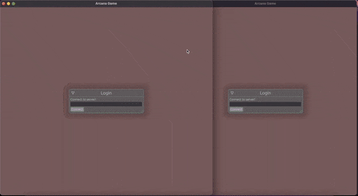

# arcana

Arcana is a game engine built with focus on ease of use without compromising on level of control.

## Getting started

Starting writing a game is as simple as calling single function: `arcana::game2` or `arcana::game3`,\
depending on what number of dimensions new game needs.\
From there add systems, load prefabs or otherwise populate game world.

Then start writing prefab implementations and input controls, implement custom rendering logic when required.

## Examples

### Tanks
Playable example can be found in `examples/tanks`.

## License

Licensed under either of

* Apache License, Version 2.0, ([license/APACHE](license/APACHE) or http://www.apache.org/licenses/LICENSE-2.0)
* MIT license ([license/MIT](license/MIT) or http://opensource.org/licenses/MIT)

at your option.

## Contributions

Unless you explicitly state otherwise, any contribution intentionally submitted for inclusion in the work by you, as defined in the Apache-2.0 license, shall be dual licensed as above, without any additional terms or conditions.
